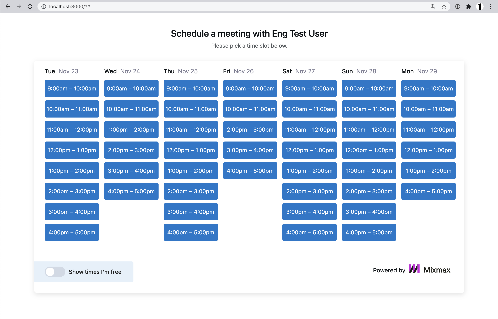

# Solution

This project implements the server-side logic for a calendar booking system that shows availability for both hosts and users, allowing users to book meetings. The calendar displays available time slots during which both the host and the user are not already booked, ensuring that double bookings are avoided.

# Setup

After unpacking the zip/tgz file, run the following:

```
cd package
npm install
npm test
npm start
```

Then open <http://localhost:3000/> in your browser.

# File structure

`./client` - Client browser files.

`./docs` - Files for the README.

`./mock` - Mock database. Use the provided `db` package as described below.

`./server` - You will need to edit these files.

# Specifications

If you look at `server/api/calendar.js`, you'll see that endpoint `/api/calendar` returns a hardcoded list of times. You need to write code to return time slots which are available for the given host in the next 7 days starting tomorrow. It should exclude time slots that overlap with events in the user's calendar. Assume that time slots last exactly one hour and start on the hour between 9am and 4pm (so the last one of the workday will be from 4pm to 5pm).

You can obtain the list of events in a user's calendar by querying a database as follows:


